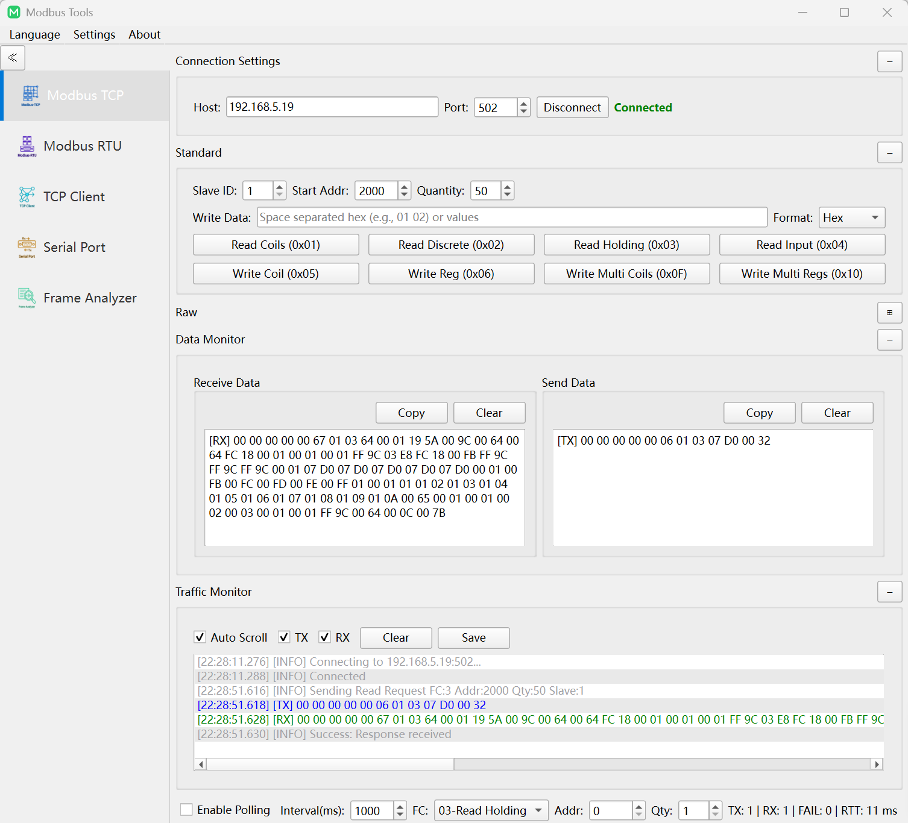
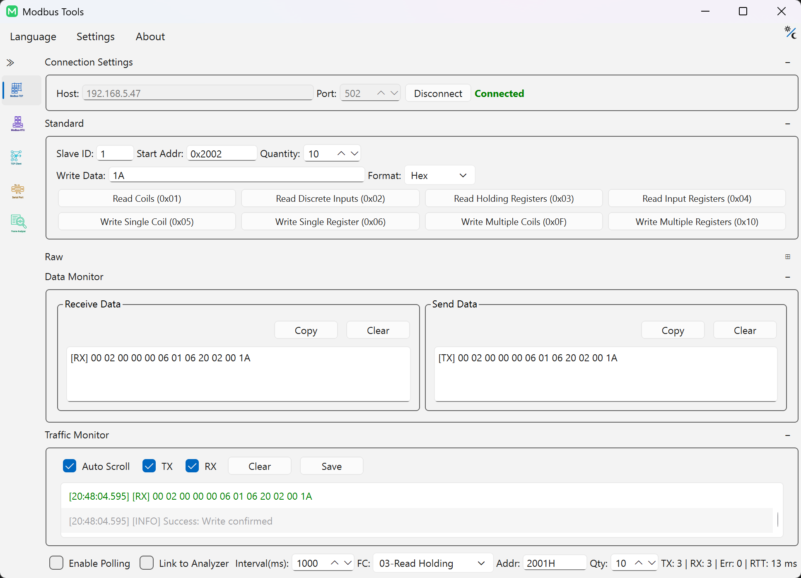
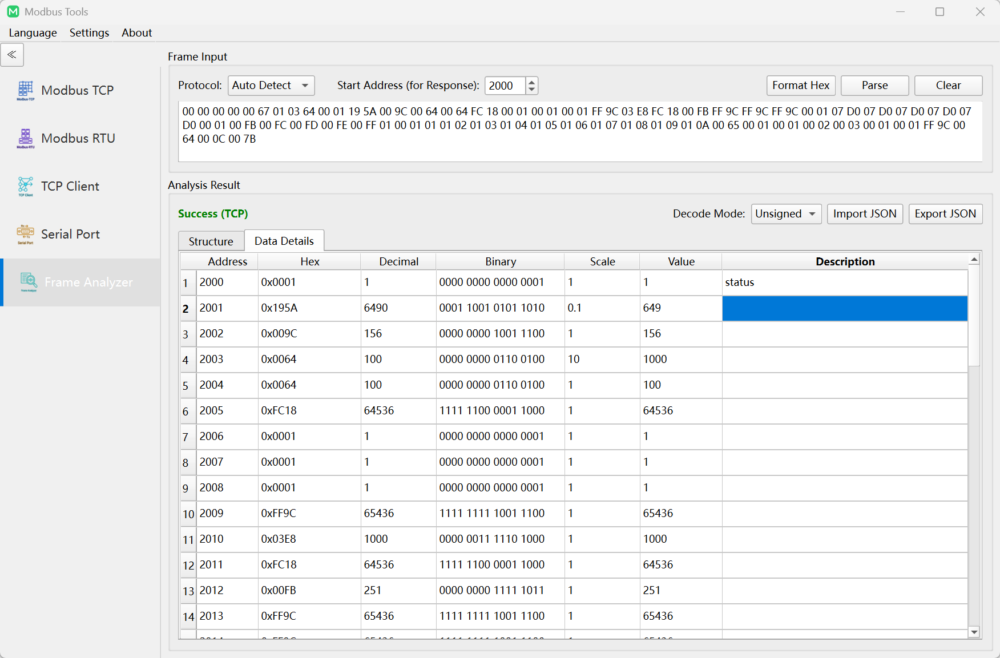
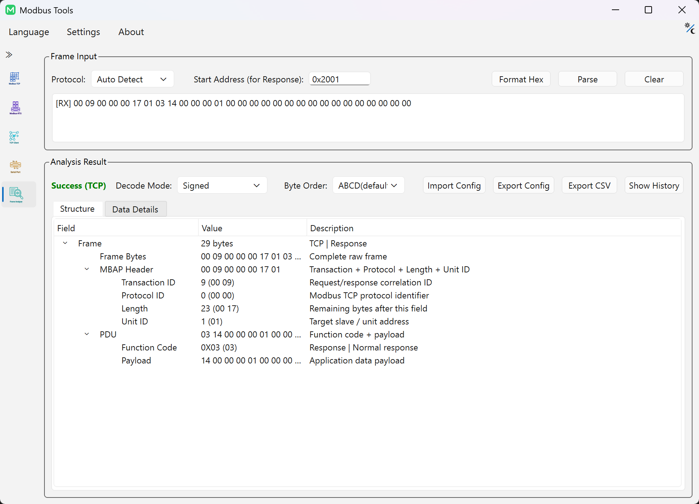
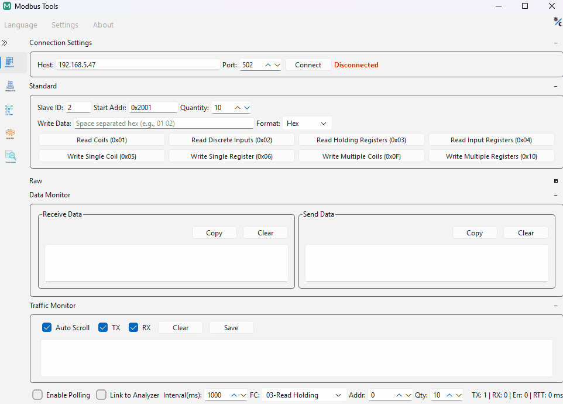

<div align="center">


# Modbus-Tools
### 專業的 Modbus TCP Client 與 Modbus RTU Master 調試及協定分析工具

**可視化幀構建 · 即時報文解析 · 可靠的連接策略**

[](https://github.com/mingyucheng692/Modbus-Tools/releases) [](https://github.com/mingyucheng692/Modbus-Tools/actions/workflows/release.yml) [](LICENSE) [](https://isocpp.org/std/the-standard) [](https://www.qt.io) [](https://cmake.org/) [](https://github.com/google/googletest)

[English](README.md) | [简体中文](README_zh-CN.md) | **繁體中文**

</div>

---

## 🔍 專案概述 (About)

**Modbus-Tools** 是一款專為 **工業物聯網 (IIoT) 調試**、**嵌入式系統開發**及**現場總線分析**設計的現代化開源輔助工具。作為功能豐富的 **Modbus 調試助手**，它支援作為 **Modbus TCP Client** 與 **Modbus RTU Master** 主動發起通訊，有效支援了工業現場中常見的 **暫存器讀取與寫入** 驗證需求。

本專案核心亮點在於其內建的 **報文分析器 (Frame Analyzer)**，能夠識別二進位位元組流並進行結構化拆解。配合特色的 **Link to Analyzer (即時聯動分析)** 模式，開發者可以在序列埠通訊測試或網路調試過程中，同步觀察協定幀的原始資料及其物理意義。無論是驗證從站設備、定位通訊故障，還是分析複雜的採樣資料，Modbus-Tools 都能提供穩健、可靠且高效的工程化支援。

---

## ✨ 核心特性 (Features)

### 🏗 可視化幀構建與原始發送
提供了直覺的工業協定組包互動，簡化了調試流程：
- **表單化參數輸入**：支援 Slave ID、起始地址、暫存器數量等核心參數的圖形化輸入。Slave ID 與地址（含輪詢地址）全面支援 **HEX (0x10, 10H)** 與 **DEC (16)** 智慧識別與合法性校驗。
- **功能碼覆蓋**：支援常用的 0x01-0x06, 0x0F, 0x10 等標準 Modbus 功能碼。
- **Raw 輔助工具**：內建「一鍵計算並追加 CRC16 (RTU)」及「一鍵封裝主站報頭 MBAP (TCP)」功能，極大簡化非標報文測試。
- **即時預覽**：在輸入參數及 Hex 資料時，同步展示對應的十六進位原始位元組流，確保發出的每一幀都符合預期。
  
> [!TIP]
> **配置提示**：輪詢欄的 `Addr` 支援獨立跨段配置，而 `Slave ID` 與功能面板即時聯動。如需同時監控多個不同從站，建議開啟多個視窗實例（僅限 TCP 模式）。
>
> **輪詢日誌策略**：單次輪詢失敗記錄為 `Warning`；連續失敗會按輪詢間隔對應的自適應閾值升級為 `Error`；恢復成功後會補充一條恢復提示。

### 🔘 線圈 (Coils) 二進位下發互動
專為位元操作設計的互動邏輯，實現對輸出狀態的直覺控制：
- **Binary 輸入模式**：支援直接輸入位元字串（如 `1 0 1 1`），系統自動將其編碼並配合 0x05 (單寫) 或 0x0F (多寫) 功能碼下發。
- **位元級感知**：配合 0x01/0x02 讀取指令，實現對遠端設備線圈與離散輸入狀態的高效驗證。

### 📊 特色幀分析器 (Frame Analyzer)
將枯燥的十六進位報文轉化為結構化的業務資料，支援深度分析：
- **協定拆解**：即時將 Hex 流拆解為 SlaveID、功能碼、起始地址、資料長度及校驗值等關鍵欄位。
- **工程量轉換**：內建 **縮放因子 (Scale Factor)**，支援將暫存器原始值自動轉換為浮點物理量（如溫度、壓力、頻率）。
- **多維位元組序分析**：支援 **ABCD (Big Endian)**、**CDAB (Little Endian Byte Swap)**、**BADC (Big Endian Byte Swap)**、**DCBA (Little Endian)** 四種位元組/字序模式，適配各類 PLC 資料排列。
- **語義標註**：支援為暫存器自定義描述，解析結果反映真實的業務指標，並支援歷史記錄批量匯出。

### 🔗 Link to Analyzer (即時聯動分析) — **特色功能**
打破流量監控與分析器之間的壁壘，實現自動化的解析流：
- **即時穿透**：擷取的 **RX 回應報文** 可自動推送至分析器解碼，消除頻繁複製 Hex 資料的繁瑣操作。
- **暫停編輯**：支援 **「暫停重新整理」** 功能，方便在高速通訊場景下駐留特定幀，進而編輯其縮放因子或暫存器描述。
- **非同步解析**：解析動作在後台非同步完成，不干擾前端流量列表的即時滾動觀測。

---

## 📋 技術規格與支援特性

### 📡 標準協定支援
| 維度 | 支援能力 | 技術細節 |
| :--- | :--- | :--- |
| **通訊模式** | **Modbus TCP Client** & **Modbus RTU Master** | 適配網口 (RJ45) 與序列埠 (RS232/RS485) 物理鏈路 |
| **功能碼集** | FC01 ~ FC04 (讀) / FC05 ~ FC06 (單寫) / FC15 ~ FC16 (多寫) | 涵蓋工業現場主流的 Modbus 應用場景 |
| **校驗機制** | 自動 CRC16 (RTU) / MBAP 標頭封裝 (TCP) | 生成並驗證報文的合規性與完整性 |

### 🛠 通用調試工具
除了深度的 Modbus 協定支援，專案同時整合了高效能的通用調試能力：
- **通用 TCP 用戶端**：支援文字/Hex 雙模式發送，適配各類非標網路協定驗證。
- **序列埠通訊助手**：支援自定義鮑率、校驗位及資料位元，整合檔案傳輸等實用功能。

---

## 📸 介面預覽 (Screenshots)

<table>
  <tr>
    <td align="center"><b>Modbus TCP 幀構建</b></td>
    <td align="center"><b>Modbus TCP 寫入操作</b></td>
  </tr>
  <tr>
    <td></td>
    <td></td>
  </tr>
  <tr>
    <td align="center"><b>報文分析器 - 地址,縮放因子與描述</b></td>
    <td align="center"><b>報文分析器 - 結構樹</b></td>
  </tr>
  <tr>
    <td></td>
    <td></td>
  </tr>
</table>

### 📺 動態演示 (Demo)


---

---

## 🚀 快速開始 (Getting Started)

### 下載與執行 (Windows)
1. 前往 [Releases](https://github.com/mingyucheng692/Modbus-Tools/releases) 頁面。
2. 下載最新的 Modbus-Tools-win64.zip。
3. 解壓並執行 Modbus-Tools.exe 即可，**無需安裝，綠色執行**。

### 源碼構建 (Build from Source)
專案基於 **Qt 6.x** 與 **CMake** 構建，支援 MSVC 編譯器：
```bash
# 複製專案及其所有子模組
git clone --recursive https://github.com/mingyucheng692/Modbus-Tools.git  --progress
cd Modbus-Tools

# 配置開發構建目錄
cmake -S . -B build

# 日常開發只編譯主程式
cmake --build build --target Modbus-Tools --config Release -j

# 當 .ts 發生變更時，單獨刷新翻譯產物
cmake --build build --target modbus_i18n --config Release

# 生成發布產物；Release 預設將翻譯編譯並嵌入到 EXE
cmake -S . -B build_release -DCMAKE_BUILD_TYPE=Release -DMODBUS_TOOLS_BUILD_TESTS=OFF -DMODBUS_TOOLS_ENABLE_ASAN=OFF
cmake --build build_release --target release_bundle --config Release -j
```

## 🧪 品質與測試 (Testing)

本專案使用 Google Test (GTest) 與 Google Mock (GMock) 框架進行自動化品質檢測。作為開源協作專案，測試覆蓋主要旨在優化邏輯一致性並降低缺陷率，**不提供任何形式的可靠性級別保障或功能安全認證**。

### 測試覆蓋範圍
- **工作階段管理**：驗證連接/斷開邏輯、請求逾時重試及異常狀態恢復。
- **協定傳輸**：涵蓋 TCP/RTU 報文封裝、解包、校驗和計算及完整性驗證。
- **解析邏輯**：針對多種有效指令及畸形報文進行魯棒性驗證，防止解析異常。
- **資料處理**：確保位元組序轉換、工程量縮放及格式化演算法的計算準確性。

### 自動化與狀態
- **測試通過率**：全量 42 個自動化測試案例已 100% 通過驗證。
- **CI 整合**：GitHub Actions 流水線整合了 MSVC AddressSanitizer (ASan)，用於記憶體損壞與洩漏的自動化監測。
- **回歸驗證**：每次 Release 發佈均執行全量回歸測試，驗證協定一致性與工作階段狀態穩健性。

### 在地執行測試
```powershell
cmake -B build -DMODBUS_TOOLS_BUILD_TESTS=ON
cmake --build build --target modbus_test
ctest --test-dir build -C Debug --output-on-failure
```

---

## ⚙️ 高級配置與工程化能力
為了適配複雜的工業現場環境，Modbus-Tools 提供了豐富的通訊控制策略：
- **重試機制**：支援自定義失敗後的重試策略。
- **多語言環境**：完整支援英文、簡體中文及繁體中文 UI。
- **OTA 自動更新**：整合 GitHub API，支援檢測並升級至最新穩定版。

---

## 🏗 專案架構

### 技術棧

| 元件 | 技術 | 說明 |
| :--- | :--- | :--- |
| **程式語言** | **C++20** | 現代 C++：constexpr, enum class, 智慧指標, std::optional |
| **GUI 框架** | **Qt 6** | Widgets, Charts, Network, SerialPort, Concurrent |
| **日誌系統** | **spdlog** | 非同步日誌 + 檔案輪替（10MB × 20 檔案） |
| **構建系統** | **CMake 3.16+** | 跨平台構建支援，整合 MSVC 並行編譯優化 |
| 單元測試 | **Google Test** | 廣泛覆蓋核心協定邏輯，旨在優化邏輯一致性 |
| **CI/CD** | **GitHub Actions** | 自動化流水線：構建、測試及 Release 發行包分發 |

### 分層架構

```text
┌─────────────────────────────────────────────────────────────┐
│                       UI 層 (ui/)                           │
│   MainWindow │ Views │ Widgets │ Theme │ i18n │ Settings    │
├─────────────────────────────────────────────────────────────┤
│                     業務邏輯層 (core/)                        │
│   ┌──────────┐   ┌────────────┐   ┌─────────────────────┐   │
│   │  Modbus  │   │  I/O 通道   │   │      通用服務        │   │
│   │  協定棧   │   │  (Channel) │   │  Logger/Settings等  │   │
│   └──────────┘   └────────────┘   └─────────────────────┘   │
├─────────────────────────────────────────────────────────────┤
│                      基礎設施層                               │
│         Qt6 Framework │ spdlog │ C++ Standard Library       │
└─────────────────────────────────────────────────────────────┘
```

---

## 🎯 適用場景

| 場景 | 描述 |
| :--- | :--- |
| **設備聯調** | 快速驗證 Modbus 從站的暫存器讀寫是否正常 |
| **協定分析** | 擷取並解析 Modbus 幀，定位通訊故障 |
| **批次測試** | 輪詢模式下持續讀取暫存器，監測資料變化 |
| **非標協定調試** | Raw 模式發送自定義 Hex 幀 |
| **教學演示** | 直觀展示 Modbus 幀結構與通訊過程 |

### 目標用戶

- 🏭 **工業自動化工程師**：PLC / DCS / SCADA / HMI / 儀器儀表 / BMS / PCS / EMS 系統調試
- 🔧 **嵌入式開發者**：Modbus 從站設備開發驗證
- 🔗 **系統整合商**：現場總線通訊問題排查
- 📚 **學習者**：Modbus 協定學習與研究

---

## 🤝 參與貢獻

歡迎提交 Issue 和 Pull Request，我們非常重視來自社群的貢獻（Bug 修正、新功能、文檔優化等）！

1. **Fork** 本倉庫
2. **建立特性分支**：`git checkout -b feature/amazing-feature`
3. **提交更改**：`git commit -m 'Add amazing feature'`
4. **推送到遠端分支**：`git push origin feature/amazing-feature`
5. **提交 Pull Request** (PR)

您的每一個 ⭐ Star 都是支持我們持續迭代的最大動力。

### 開發者憑證 (DCO)

本專案採用 **開發者原創證書 (DCO)** 確保貢獻的知識產權清晰。提交 Pull Request 時，請確保您的每個 commit 包含如下簽名行：

```text
Signed-off-by: 您的名字 <您的電子郵件>
```

使用 `git commit -s` 可自動添加此行。透過簽署 DCO，您確認：
- 該貢獻是由您創作和/或您有權提交；
- 您同意該貢獻按本專案的 MIT 許可證授權；
- 您理解該貢獻可能會被修改或重新分發。

---

## 📄 開源許可

本專案基於 [MIT License](LICENSE) 開源。

Copyright © 2025 - present mingyucheng692

### 🔄 二次分發要求
- 任何對本專案的修改、衍生作品或二次分發行為，**必須完整保留原始版權聲明及本許可文件**。
- 分發時不得刪除、篡改或隱藏本專案源碼、文檔及構建產物中的任何版權標識、作者署名與許可聲明。

### ⚖️ 第三方依賴許可證摘要

本專案主要使用以下第三方庫。用戶在二次開發或分發時，應遵守其原有的開源許可協議。

| 依賴項 | 許可證 | 說明 |
| :--- | :--- | :--- |
| **Qt 6** | LGPLv3 | 以動態連結方式使用，支持用戶自由替換庫文件，未修改源碼。 |
| **spdlog** / **fmt** | MIT | 廣泛應用於日誌記錄與格式化，需保留原始版權聲明。 |
| **Google Test** | BSD-3-Clause | 僅用於開發環境測試。 |


---

## ⚖️ 免責聲明

### 1. 用途限制
本專案僅適用於開發調試、設備檢測及教學演示。在此類關鍵或生產環境中使用，需用戶自行承擔全部風險。

### 2. 無擔保聲明
本軟體按 "原樣" (AS IS) 提供。不保證軟體滿足特定需求，不對 Modbus 幀構建或解析結果的準確性提供絕對擔保。

### 3. 責任限制
在任何情況下，作者或版權持有人均不承擔因使用本軟體導致的直接或間接損害責任。

### 4. 合規性說明
本軟體未通過任何工業安全認證（如 SIL, IEC 61508），校驗演算法僅供調試參考。用戶需確保其使用符合在地法律。

### 5. 資料與隱私
本軟體尊重用戶隱私，遵循最小資料原則：
- **在地資料**：通訊配置、解析範本及用戶偏好均存儲於在地。
- **自動更新**：更新檢查功能透過 HTTPS 訪問 GitHub API，僅發送應用版本號及平台標識。
- **網路通訊**：Modbus TCP 連接由用戶主動發起，僅連接指定的地址。
- **不收集**：本軟體不收集、存儲或傳輸用戶個人及敏感資訊。

---

### 🙏 致謝

感謝以下開源專案使 Modbus-Tools 成為可能：
- [Qt](https://www.qt.io) — 跨平台應用框架
- [spdlog](https://github.com/gabime/spdlog) — 高效能 C++ 日誌庫
- [fmt](https://github.com/fmtlib/fmt) — 現代 C++ 格式化庫
